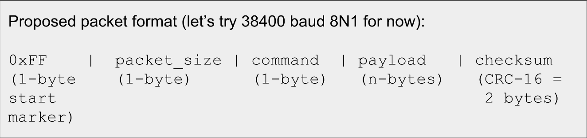

# Packet Format Between Computer and Redboard Turbo

* Proposed format for packet (38400 baud 8N1)

    * 0xFF (1-byte start marker)

    * packet_size (1-byte)

    * Commands (1-byte):
      * 0 = set left motor 
      * 1 = set right motor 
      * 2 = set servo
      * 3 = set LCD cursor 
      * 4 = print string 
      * 5 = LCD print string
      * 6 = clear LCD

    * payload (n-bytes)
      * 0 = 1-byte payload: speed
      * 1 = 1-byte payload: speed
      * 2 = 2-byte payload: servo_num, position
      * 3 = 1-byte payload: col, row
        * 2 LSB for row
        * 6 MSB for col
      * 4 = num_chars, string
      * 5 = col, row, num_chars, string
      * 6 = 0-byte payload

    * checksum (CRC-16 = 2 bytes)

